# 0005-GCM-Windows重新安装Git

## 问题出现

1. 当使用GitHub私人token拉取项目之后，再通过VSC使用Git拉取项目（别的项目），就容易出现这一问题。

## 解决办法

在Windows系统下：重新安装Git。

## 先卸载

在程序与功能界面：直接点击卸载即可。

## 重新安装

下载最新版的Git安装包，点击安装。

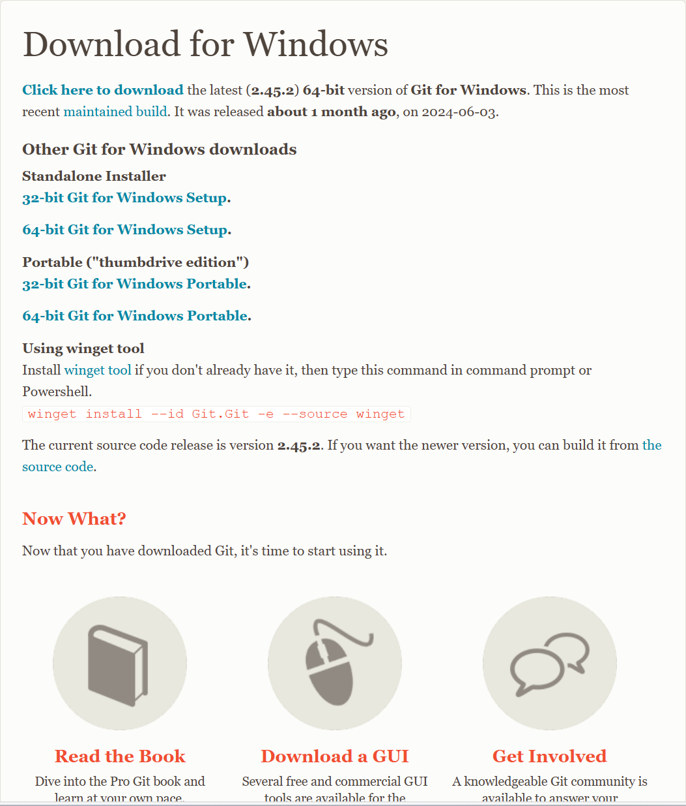

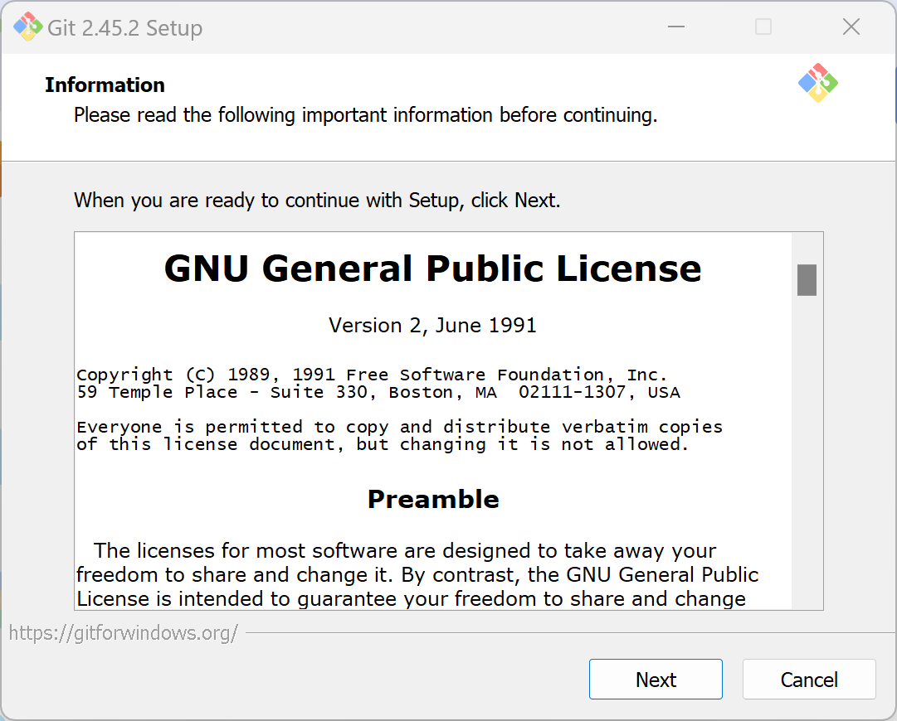

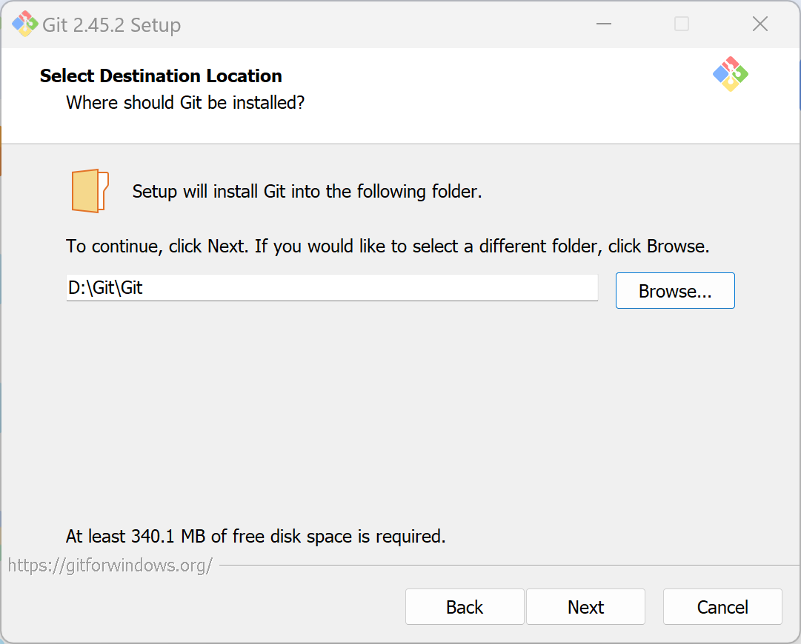

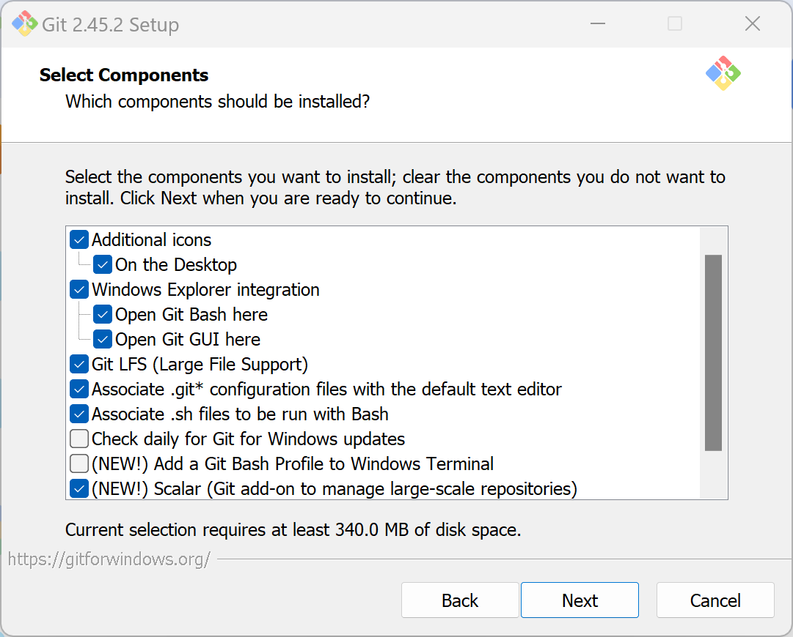

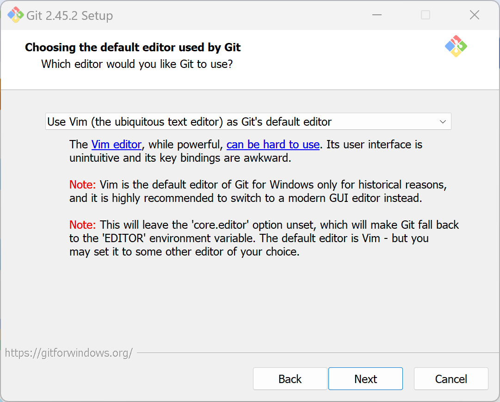

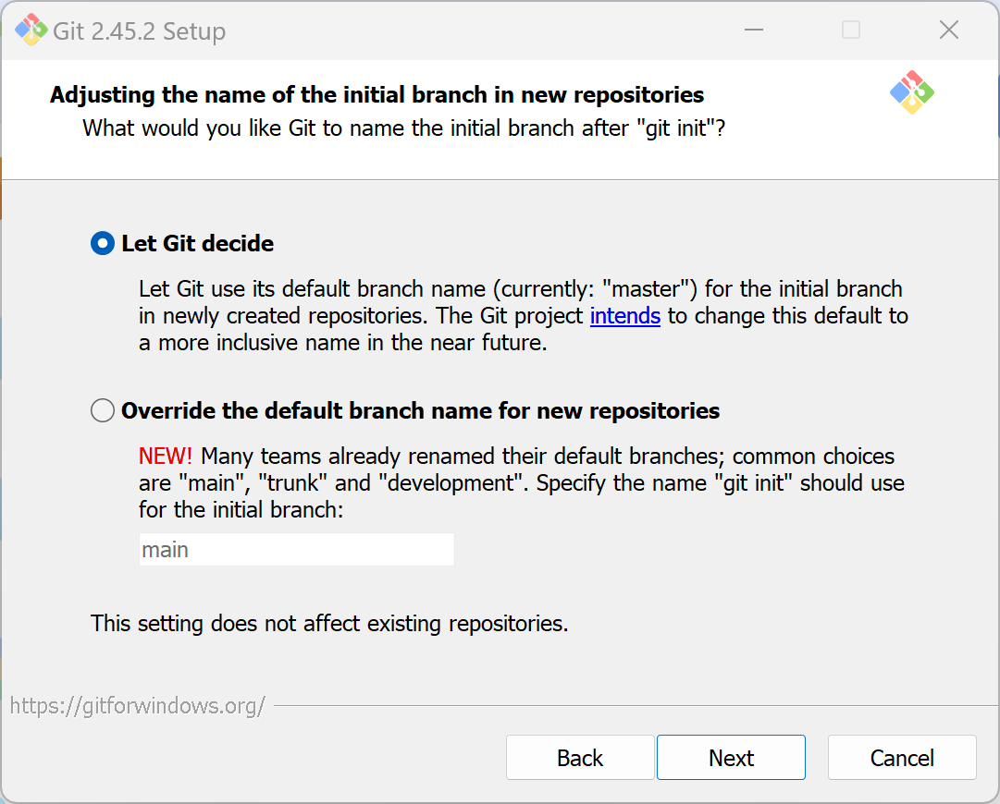

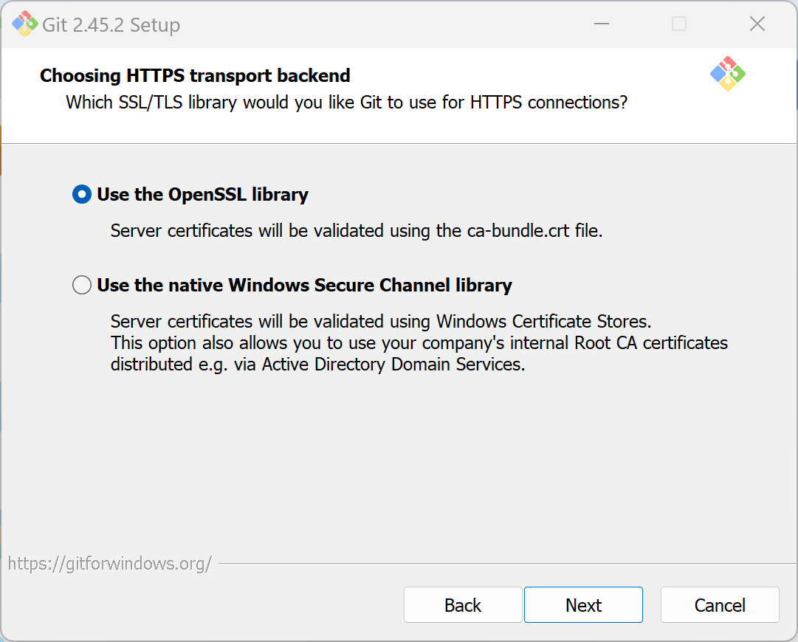

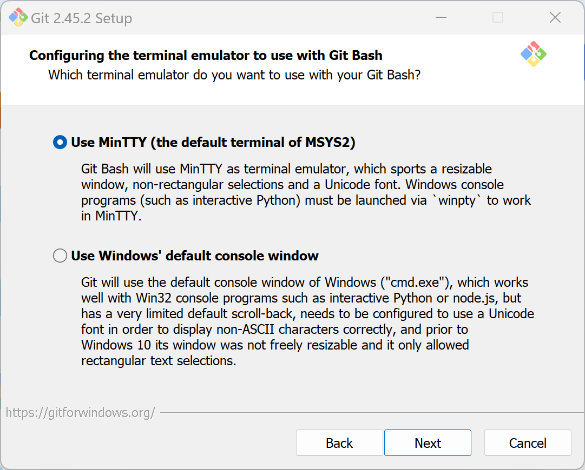

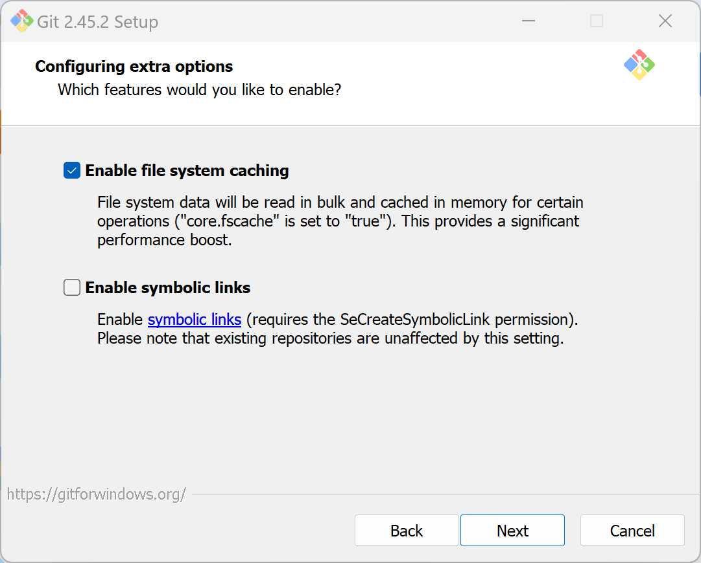

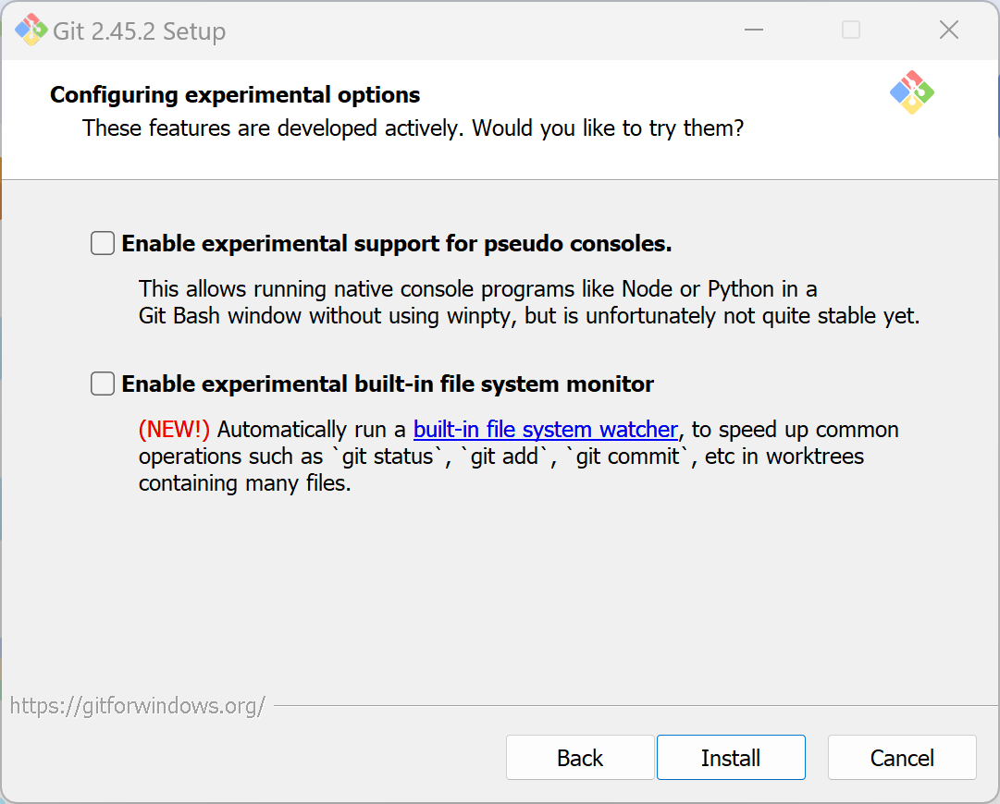

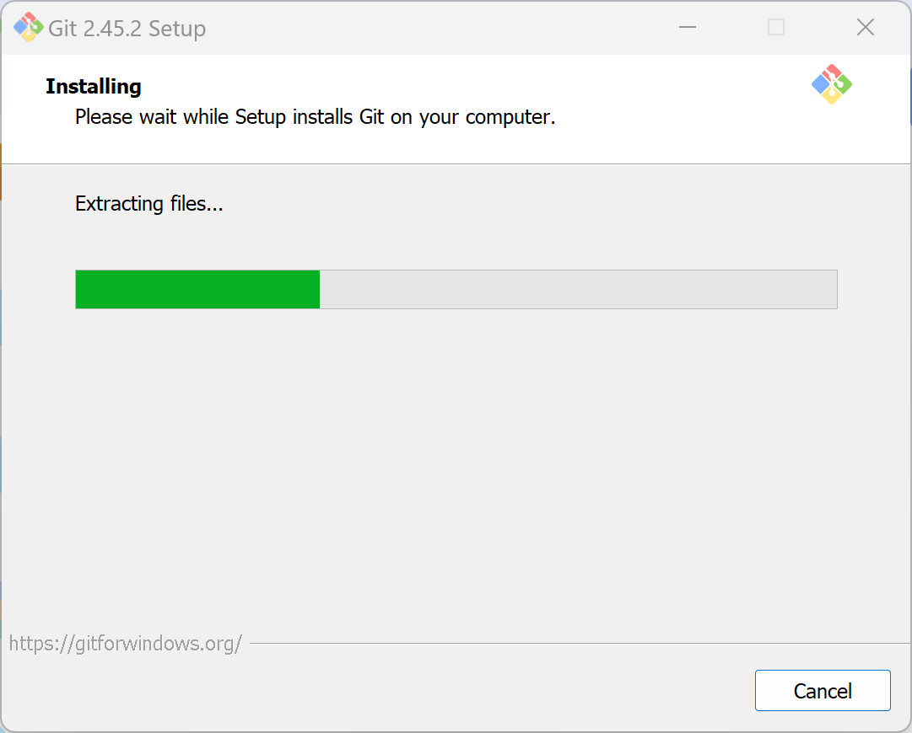

